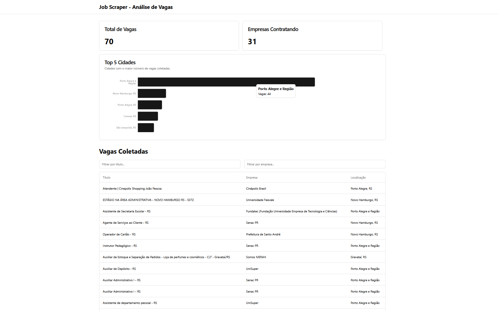

# Job Scraper & Analytics Dashboard (LinkedIn)

**Status do Projeto: Concluído (Versão 1.0)**

Este projeto é um sistema full-stack de automação e análise de dados. Ele consiste em um web scraper avançado que utiliza **Playwright** para coletar dados de vagas de emprego diretamente do **LinkedIn**, uma API RESTful em **Python/FastAPI** para servir esses dados, e um dashboard interativo em **React** para visualização e filtragem.

### Screenshots

| Dashboard de Análise |
| :---: |
|  |

---

### Destaques para Recrutadores

Este projeto demonstra competências que vão além de um CRUD básico, focando em desafios realistas de engenharia e visualização de dados.

* **Scraping de Sites Dinâmicos (JavaScript-heavy):** Utilização do **Playwright** para controlar um navegador headless, aguardar o carregamento de conteúdo dinâmico, interagir com a página (rolagem, fechar modais) e extrair dados de uma plataforma complexa e protegida como o LinkedIn.
* **Arquitetura Full-Stack Poliglota:** Integração de um backend em **Python (FastAPI)** com um frontend em **JavaScript/TypeScript (React)**, simulando uma arquitetura de microserviços.
* **Ciclo Completo de Engenharia de Dados:**
    * **Coleta:** Web scraping avançado e robusto.
    * **Armazenamento:** Persistência em banco de dados relacional (SQLite) com ORM (**SQLModel**).
    * **Processamento:** Lógica de agregação no backend para gerar analytics (contagem de vagas por cidade).
    * **Visualização:** Apresentação dos dados em um dashboard interativo com tabelas, filtros e gráficos (`Recharts`).
* **API RESTful Moderna:** API com **FastAPI** que inclui documentação interativa automática (Swagger UI), validação de dados com Pydantic e design de API modular com `APIRouter`.
* **Frontend Reativo e Profissional:** UI construída com **Vite, React, TypeScript, Tailwind CSS e Shadcn/ui**, demonstrando domínio de um ecossistema de frontend moderno e produtivo.

---

### Tecnologias Utilizadas

#### **Backend**
* **Python 3.11+**
* **Playwright** (Web Scraping de sites dinâmicos)
* **BeautifulSoup4** (HTML Parsing)
* **FastAPI** (Framework da API)
* **SQLModel** (ORM) & **SQLAlchemy**
* **Uvicorn** (Servidor ASGI)
* **SQLite** (Banco de Dados)

#### **Frontend**
* **React**
* **Vite**
* **TypeScript**
* **Tailwind CSS**
* **Shadcn/ui** (Biblioteca de Componentes)
* **Recharts** (Gráficos)
* **Axios** (Cliente HTTP)

---

### Como Executar o Projeto Localmente

Siga os passos abaixo para configurar e rodar a aplicação.

#### Pré-requisitos
* Node.js (v18+) e NPM
* Python (v3.11+)
* Docker (Opcional, se for usar PostgreSQL no futuro)

#### 1. Clonar o Repositório
```bash
git clone https://github.com/AndreBauzil/python-job-scraper
cd python-job-scraper
```

#### 2. Configurar o Backend (Python)
```bash
# Crie e ative o ambiente virtual
python -m venv venv
# Windows
.\venv\Scripts\activate
# Mac/Linux
source venv/bin/activate

# Instale as dependências Python
pip install sqlmodel httpx beautifulsoup4 lxml "fastapi[all]" playwright

# Instale os navegadores para o Playwright
playwright install

# Rode o scraper para popular o banco de dados
python scraper/main.py

# Inicie o servidor da API
python -m uvicorn api.main:app --reload
# A API estará rodando em http://localhost:8000
```

#### 3. Configurar o Frontend (React)
```bash
# Em um novo terminal, navegue para a pasta do frontend
cd frontend

# Instale as dependências
npm install

# Inicie a aplicação React
npm run dev
# A aplicação estará disponível em http://localhost:5173
```
